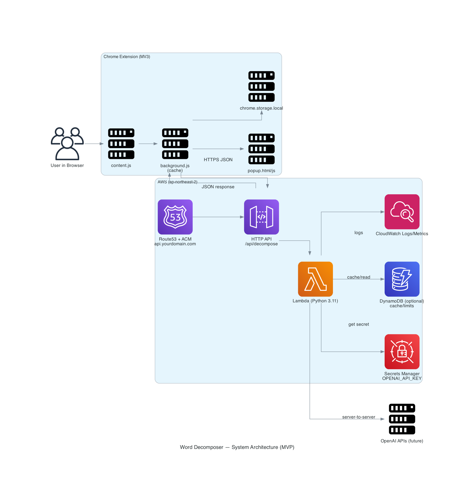

# VocaCrush Backend (Word Decomposer API)

> Chrome Extension용 프록시 API — **AWS API Gateway + Lambda (Python 3.11)** 기반

## Overview

사용자가 웹페이지에서 더블클릭 / 드래그 후 우클릭 / 오래 올려두기 같은 제스처를 하면 단어를 캡처

확장프로그램의 content script가 단어를 백엔드 API로 전송
→ 백엔드는 https://api.yourdomain.com/api/decompose (AWS API Gateway + Lambda)

응답으로 온 단어 분석 결과를 페이지 위에 오버레이(UI 패널) 로 표시

API 키는 확장프로그램에 포함하지 않고 서버에서만 사용

백엔드 레포: VocaCrush Backend (Word Decomposer API)

📁 Repository Structure (제안)
extension/
├─ manifest.json          # MV3 설정
├─ content.js             # 페이지에 주입되어 단어 이벤트 감지 + API 호출
├─ ui.js                  # 오버레이/툴팁 렌더링 분리용 (선택)
├─ styles.css             # 패널 스타일
└─ README.md              # (이 문서)

나중에 popup/options 페이지를 붙이면 popup/, options/ 폴더 추가

## How it Works

manifest.json에서 모든 http/https 페이지에 content.js를 주입

content.js가 사용자의 선택 텍스트를 감지

선택된 단어를 JSON으로 백엔드 API에 전송

응답을 받아 DOM에 작은 패널을 만들어 띄움

패널 위치는 마우스 위치 기준으로 살짝 오른쪽/아래로

---

## Setup (Local)

이 폴더를 아무 데나 두고

Chrome → chrome://extensions → “개발자 모드” ON

“압축 해제된 확장 프로그램을 로드” → 이 폴더 선택

아무 웹페이지 열고 단어 더블클릭 → DevTools 콘솔에서 로그 확인

---

## manifest.json (예시)
{
  "manifest_version": 3,
  "name": "VocaCrush Helper",
  "version": "0.1.0",
  "description": "더블클릭한 단어를 분석해서 보여줍니다.",
  "permissions": [],
  "content_scripts": [
    {
      "matches": ["http://*/*", "https://*/*"],
      "js": ["content.js"],
      "css": ["styles.css"]
    }
  ]
}

## content.js (개략)
const API_BASE = "https://api.yourdomain.com"; // 백엔드 README에 있던 그 API

document.addEventListener("dblclick", async (e) => {
  const word = window.getSelection().toString().trim();
  if (!word) return;

  // 로딩 UI 표시
  showPanel(e.pageX + 10, e.pageY + 10, "Loading...");

  const res = await fetch(`${API_BASE}/api/decompose`, {
    method: "POST",
    headers: { "Content-Type": "application/json" },
    body: JSON.stringify({ word })
  });

  const data = await res.json();
  renderWordPanel(e.pageX + 10, e.pageY + 10, data);
});

백엔드의 응답 포맷을 README에 명시해뒀으니 그대로 맞춰 파싱하면 됨.

## Security Notes

API 키는 절대 이 확장프로그램에 넣지 않는다.

이 확장프로그램은 익명 사용자가 쓸 수 있으므로, 백엔드에서 CORS/Rate Limit/WAF로 1차 방어.

출시 직전에는 CORS를 chrome-extension://<YOUR_EXT_ID>로 좁히는 걸 권장.

## Roadmap

 더블클릭 외 이벤트 지원 (mouseover-hold, selection + context menu)

 패널 드래그 이동 / 닫기 버튼

 최근 조회 단어 popup 페이지에 저장 (chrome.storage)

 백엔드 의미 필드 확장 시 UI도 연동

 배포 자동화 (zip 생성 → CWS 업로드는 수동)
